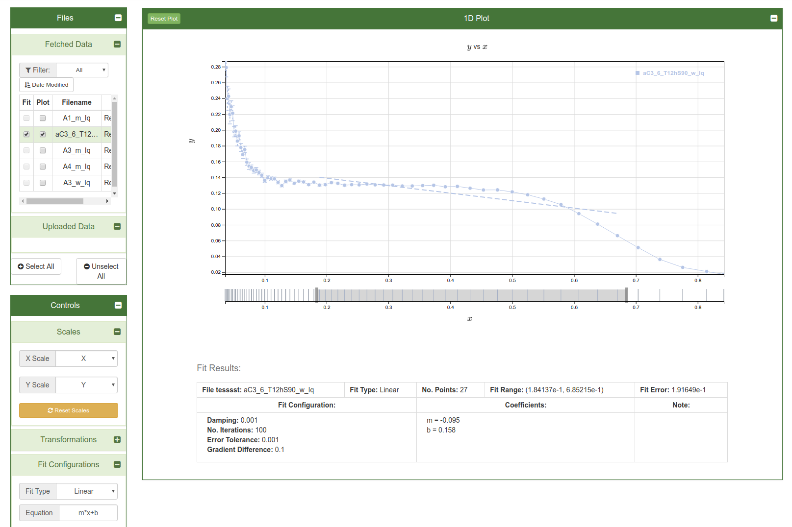
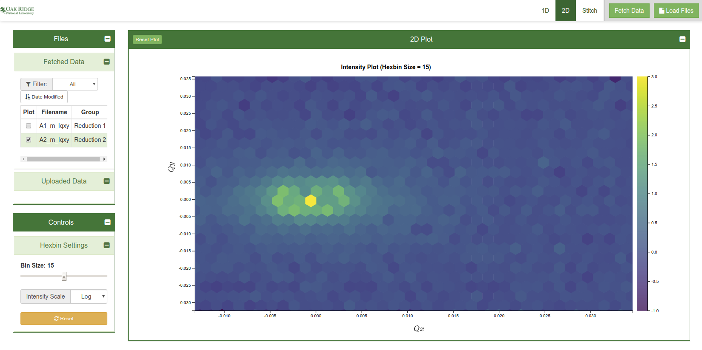

# Small Angle Scattering Web Data Analysis framework

Features:

* 1D Data analysis:
    - Fitting of General SAS Curves (Guinier, Porod, etc)
    - Fitting of user defined curves / equations
    

* 2D Data analysis:
    - Hexagonal rebining of I(qx,qy) data
    

* 1D curve stitching / merging
    

## Create a .env file

Copy `env.base` to `.env` and modify it according to your needs.

## Start file provider mocking server

Note that the mocking server needs `Python Flask`.

First check if flask is installed:

```
python -c "import flask; print(flask.__version__);"
```

If no errors are displayed, you are good to go. Otherwise install Flask:

```
pip install Flask --user
```

To launch the server:

```bash
cd src/assets
python server.py
```

Or in a different host / port:

```
usage: server.py [-h] [--host [HOST]] [--port [PORT]]

optional arguments:
  -h, --help            show this help message and exit
  --host [HOST], -o [HOST]
                        default host: localhost
  --port [PORT], -p [PORT]
                        default port: 8000
```

The server can be tested with:
http://localhost:8000/files/sans1d/A1_m_Iq_wedge_0.txt


## Build Setup


### Install dependencies

```
npm install
```

### Serve with hot reload

By default the node server is launched on `localhost:8080`.

```
npm run dev
```

See `.env` the variables for other configurations:

```
NODE_HOST = ...
NODE_PORT = ...
```


### Build for production with minification


**Note:**

This is not working yet.

```
npm run build
```

Error:

```
10 verbose lifecycle vue-file-upload@1.0.0~build: CWD: /home/rhf/git/sns-plot-fit
11 silly lifecycle vue-file-upload@1.0.0~build: Args: [ '-c',
11 silly lifecycle   'cross-env NODE_ENV=production webpack --progress --hide-modules' ]
12 silly lifecycle vue-file-upload@1.0.0~build: Returned: code: 2  signal: null
13 info lifecycle vue-file-upload@1.0.0~build: Failed to exec build script
14 verbose stack Error: vue-file-upload@1.0.0 build: `cross-env NODE_ENV=production webpack --progress --hide-modules`
14 verbose stack Exit status 2
14 verbose stack     at EventEmitter.<anonymous> (/usr/local/lib/node_modules/npm/lib/utils/lifecycle.js:283:16)
14 verbose stack     at emitTwo (events.js:125:13)
14 verbose stack     at EventEmitter.emit (events.js:213:7)
14 verbose stack     at ChildProcess.<anonymous> (/usr/local/lib/node_modules/npm/lib/utils/spawn.js:40:14)
14 verbose stack     at emitTwo (events.js:125:13)
14 verbose stack     at ChildProcess.emit (events.js:213:7)
14 verbose stack     at maybeClose (internal/child_process.js:887:16)
14 verbose stack     at Process.ChildProcess._handle.onexit (internal/child_process.js:208:5)
15 verbose pkgid vue-file-upload@1.0.0
16 verbose cwd /home/rhf/git/sns-plot-fit
17 verbose Linux 4.4.0-96-generic
18 verbose argv "/usr/bin/nodejs" "/usr/local/bin/npm" "run" "build"
19 verbose node v8.0.0
20 verbose npm  v5.0.0
21 error code ELIFECYCLE
22 error errno 2
23 error vue-file-upload@1.0.0 build: `cross-env NODE_ENV=production webpack --progress --hide-modules`
23 error Exit status 2
24 error Failed at the vue-file-upload@1.0.0 build script.
24 error This is probably not a problem with npm. There is likely additional logging output above.
25 verbose exit [ 2, true ]

```
See:
https://webpack.js.org/guides/production/


